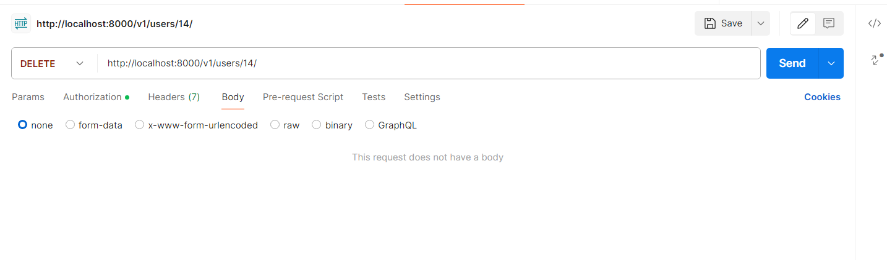

# Prueba Técnica Petromil


**API para gestionar el acceso a la aplicación y así poder gestionar
el listar,crear,editar y eliminar usuarios**


> *Para el despliegue y ejecución de este proyecto lo primero que hacemos es descargar el archivo que contiene el código fuente de proyecto de la api desde el siguiente enlace: [GitHub](https://github.com/YeroDev/Prueba_tecnica_petromil.git "Prueba_tecnica_petromil")* 

## Instalacion
1. Instalar Python desde su página oficial: [Python](https://www.python.org/downloads/ "Python")


2. Luego de instalar Python, el paso siguiente es abrir una terminal de comandos, nos ubicamos en la ruta principal del proyecto para crear el entorno virtual de ejecución que nos permita correr el proyecto, para esto efectuamos la siguiente instrucción en la terminal. 

>**python3 -m venv nombre_entorno**

3. Después de crear el entorno virtual, debemos activar dicho entorno ejecutando el siguiente comando. 

>**.\nombre_entorno\scripts\activate**

4. El paso siguiente es instalar todas las dependencias de nuestro proyecto, esto lo hacemos con el siguiente comando.  

>**pip install**

Dependencias del proyecto.

> * asgiref==3.6.0
> * attrs==22.2.0
> * Django==4.1.5
> * djangorestframework==3.14.0
> * djangorestframework-simplejwt==5.2.2
> * drf-extensions==0.7.1
> * drf-spectacular==0.25.1
> * inflection==0.5.1
> * jsonschema==4.17.3
> * PyJWT==2.6.0
> * pyrsistent==0.19.3
> * pytz==2022.7
> * PyYAML
> * sqlparse==0.4.3
> * tzdata==2022.7
> * uritemplate==4.1.1

Ejemplo: **pip install Django==4.1.5**

Si se ha seguido las indicaciones correctamente, ya está todo configurado para correr el proyecto utilizando la instrucción siguiente:

**python manage.py runserver**


## Rutas o EndPoint
* [Login](http://localhost:8000/api/login/ "Login")   Metodo Post
* [Listar](http://localhost:8000/v1/users/ "Listar")  - Metodo Get
* [Listar un usuario](http://localhost:8000/v1/users/1/ "Listar un usuario")  - Metodo Get
* [Crear](http://localhost:8000/v1/users/ "Crear")  - Metodo Post
* [Editar](http://localhost:8000/v1/users/1/ "Editar")  - Metodo Put
* [Eliminar](http://localhost:8000/v1/users/1/ "Eliminar")  - Metodo Delete


## Login


> Habiendo corrido nuestro proyecto, lo Primero que hacemos es loguearnos con nuestro *username* y nuestro *password* en la ruta [Login](http://localhost:8000/api/login/ "Login"), mandándoles en el body y en formato JSON el username y el password de la siguiente manera.


La respuesta que esto nos devolverá será un JSON con un token, refresh_token, usuario con sus datos y un mensaje.


 Con el token dado de **login**, tendremos acceso a las rutas de listar, listar un *usuario*, *creación*, *edición* y *eliminación*.


## Crear

Para acceder a esta ruta [Crear](http://localhost:8000/v1/users/ "Crear") necesitamos el método **POST**, en **Authorization** un token de tipo **Bearer token** el cual nos lo provee el login, y en el **Body** y en formato **Json** estos datos.

 ```Json

 {
    "first_name" : "CharField()",
    "last_name" : "CharField()",
    "date_birth" : "DateField()",
    "address" : "CharField()",
    "password" : "CharField()",
    "mobile_phone" : "IntegerField()"
}

 ```
 

De la siguiente manera.

 ```Json

{
    "first_name": "Yeromis",
    "last_name": "Suarez Algarin",
    "date_birth": "2000-08-18",
    "address": "carrera",
    "password": "123456",
    "mobile_phone": 300000000
}

 ```


Esto nos dará por respuesta, el usuario creado con todos sus datos y la **password** encriptada.


## Listar


Para acceder a esta ruta [Listar](http://localhost:8000/v1/users/ "Listar") necesitamos el método **GET** y en **Autorización** un token de tipo **Bearer token** el cual nos lo provee el login.


Esto nos dará por respuesta, todos los usuarios que estén registrados en la base de datos.


## Listar un solo usuario


Para acceder a esta ruta [Listar un usuario](http://localhost:8000/v1/users/1/ "Listar un usuario") necesitamos el método **GET** en **Authorization** un token de tipo **Bearer token** el cual nos lo provee el login y en la ruta enviarle el **ID** del usuario a listar de la siguiente manera.


Esto nos dará por respuesta, el usuario solicitado.


## Editar

Para acceder a esta ruta [Editar](http://localhost:8000/v1/users/1/ "Editar") necesitamos el metodo **PUT**, en **Authorization** un token de tipo **Bearer token** el cual nos lo provee el login, en la ruta el **ID** del usuario que queremos editar y en el **Body** y en formato **JSON** con los datos a editar.

 ```Json

{
    "first_name": "Yeromis",
    "last_name": "Suarez Algarin",
    "date_birth": "2000-08-18",
    "address": "carrera",
    "password": "123456",
    "mobile_phone": 300000000
}

 ```

De la siguiente manera.


Esto nos dará por respuesta, el usuario editado con todos sus datos y la **password** encriptada.


## Eliminar


Para acceder a esta ruta [Eliminar](http://localhost:8000/v1/users/1/ "Eliminar") necesitamos el metodo **Delete** en **Authorization** un token de tipo **Bearer token** el cual nos lo provee el login y en la ruta enviarle el **ID** del usuario a eliminar de la siguiente manera.




Esto nos dará por respuesta, el usuario eliminado.

